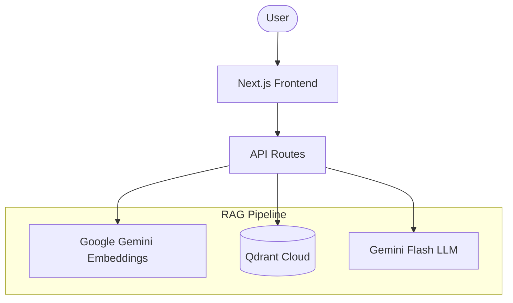

# 🧠 Google NotebookLM RAG Clone

A RAG-powered application inspired by Google NotebookLM — upload any PDF or Text document and have an intelligent conversation with it. Answers are grounded in your document's actual content, not the LLM's general knowledge.

## Submitted By
- **Name:** Snehangshu Roy
- **Roll Number:** 24BCS10155

## 🚀 Key Features
- **Upload** — Drop PDF or Text documents into the app.
- **Process** — Automatic chunking, embedding, and indexing.
- **Chat** — Ask natural language questions grounded in the document.
- **Markdown Support** — Responses are beautifully formatted with bold text, lists, and more.
- **Clean UI** — A premium, distraction-free interface with smooth animations.

## 🏗️ Architecture



Alternatively, here is the simplified flow:
**Frontend** ↔ **API Routes** ↔ **Qdrant (Vector DB)**
&nbsp;&nbsp;&nbsp;&nbsp;&nbsp;&nbsp;&nbsp;&nbsp;&nbsp;&nbsp;&nbsp;&nbsp;&nbsp;&nbsp;&nbsp;&nbsp;&nbsp;&nbsp;&nbsp;&nbsp;↕
&nbsp;&nbsp;&nbsp;&nbsp;&nbsp;&nbsp;&nbsp;&nbsp;&nbsp;&nbsp;&nbsp;&nbsp;&nbsp;&nbsp;&nbsp;&nbsp;**Google Gemini AI**

## 🔧 RAG Pipeline — End to End

### 1. Document Ingestion (`src/lib/rag.ts`)
When a user uploads a document:
**Upload → Parsing → Chunking → Embedding → Vector Storage**

### 2. Chunking Strategy: `RecursiveCharacterTextSplitter`
We use `RecursiveCharacterTextSplitter` from LangChain to preserve semantic boundaries.
- **Chunk Size:** 1000 characters
- **Chunk Overlap:** 200 characters
- **Separators:** Priority order: `\n\n`, `\n`, `. `, ` `, ``

### 3. Embedding Model
- **Model:** `gemini-embedding-001`
- **Dimensions:** 3072
- **Provider:** Google Generative AI

### 4. Vector Database: Qdrant Cloud
- **Collection:** `notebook-llm-docs`
- **Search:** Cosine similarity for finding relevant chunks.
- **Auto-Migration:** Automatic collection recreation on dimension mismatch.

### 5. Generation (`src/app/api/chat/route.ts`)
- **LLM:** `gemini-flash-latest`
- **Context Grounding:** Strict system prompt ensures the LLM answers ONLY from the provided context.
- **Formatting:** Responses are rendered using `react-markdown`.

## 🛠️ Tech Stack
| Component | Technology |
|-----------|------------|
| Framework | Next.js 15+ (App Router) |
| Language  | TypeScript |
| Styling   | Tailwind CSS + Framer Motion |
| Embeddings| Google Gemini Embeddings |
| Vector DB | Qdrant Cloud |
| LLM       | Google Gemini Flash |
| Markdown  | react-markdown + remark-gfm |

## 📁 Project Structure
```
NoteBook-LLM/
├── src/
│   ├── app/
│   │   ├── api/
│   │   │   ├── upload/route.ts  # File upload & indexing
│   │   │   └── chat/route.ts    # RAG Chat logic
│   │   ├── globals.css          # Design system
│   │   ├── layout.tsx           # Root layout
│   │   └── page.tsx             # Interactive UI
│   ├── lib/
│   │   └── rag.ts               # Core RAG logic & Qdrant client
├── .env                         # API Keys (gitignored)
├── package.json                 # Dependencies
└── README.md                    # Documentation
```

## 🚀 Local Setup

### Prerequisites
- Node.js 18+
- Google AI API key ([ai.google.dev](https://ai.google.dev))
- Qdrant Cloud account ([cloud.qdrant.io](https://cloud.qdrant.io))

### Steps
1. **Clone the repository**
   ```bash
   git clone https://github.com/SnehangshuRoy/NoteBook-LLM.git
   cd NoteBook-LLM
   ```

2. **Install dependencies**
   ```bash
   npm install --legacy-peer-deps
   ```

3. **Configure environment variables**
   Create a `.env` file in the root:
   ```env
   GOOGLE_API_KEY=your_key_here
   QDRANT_URL=https://your-cluster.cloud.qdrant.io:443
   QDRANT_API_KEY=your_key_here
   ```

4. **Start the server**
   ```bash
   npm run dev
   ```

5. **Open in browser**
   [http://localhost:3000](http://localhost:3000)

## 📝 License
MIT License — Snehangshu Roy
